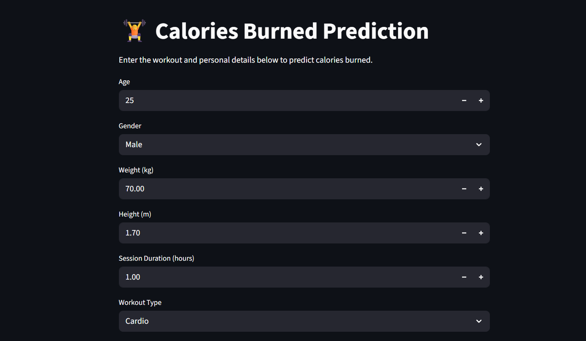
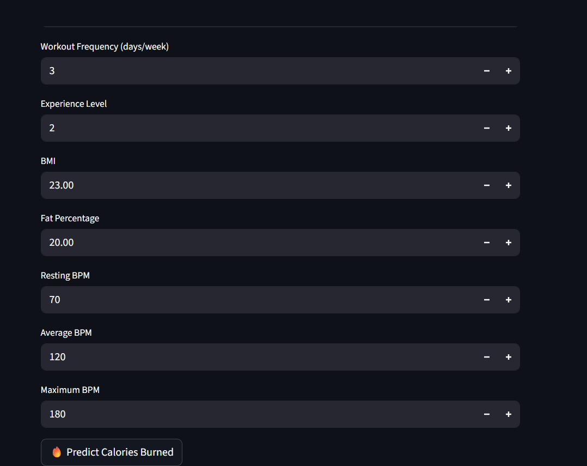

# 🏋️ Calories Burned Prediction

A machine learning web app that predicts **how many calories a person burns in a workout session**. It is built with **Python, scikit-learn and Streamlit**. Enter your personal details and workout stats, click one button, and get an instant prediction.




---

## ✨ Features

- Clean, easy-to-use web interface built with Streamlit
- Predicts calories burned from **14 inputs** (personal details, workout details and heart-rate data)
- Input limits on every field to keep values realistic
- Handles prediction errors and shows a message instead of crashing

## 🧠 How the Model Works

The trained model is saved as a scikit-learn **Pipeline** (`calories_burned_prediction_model.pkl`) with two steps:

1. **Preprocessing (`ColumnTransformer`)**
   - `StandardScaler` for the numeric features
   - `OneHotEncoder` for the categorical features (`Gender`, `Workout_Type`)
2. **Model:** `RandomForestRegressor`

Because preprocessing is part of the pipeline, the app can pass raw user input straight to the model with no manual scaling or encoding.

The repo also contains `linear_model.pkl`, a plain Linear Regression model that can be used as a baseline for comparison.

## 📊 Dataset

The model is trained on `gym_members_exercise_tracking.csv`, which has **973 gym members** and 15 columns.

| Column | Description |
|--------|-------------|
| Age | Age of the member |
| Gender | Male / Female |
| Weight (kg) | Body weight |
| Height (m) | Height in metres |
| Max_BPM | Maximum heart rate during workout |
| Avg_BPM | Average heart rate during workout |
| Resting_BPM | Resting heart rate |
| Session_Duration (hours) | Length of the workout |
| Workout_Type | Cardio / HIIT / Strength / Yoga |
| Fat_Percentage | Body fat percentage |
| Water_Intake (liters) | Daily water intake |
| Workout_Frequency (days/week) | Workouts per week |
| Experience_Level | Experience from 1 to 5 |
| BMI | Body Mass Index |
| **Calories_Burned** | **Target: calories burned in the session** |

## 🛠️ Tech Stack

| Technology | Purpose |
|------------|---------|
| Python 3 | Core language |
| Pandas | Data handling |
| scikit-learn | Model training and preprocessing |
| Joblib | Saving and loading the model |
| Streamlit | Web interface |

## 📁 Project Structure

```
├── 2MLproject.py                          # Streamlit app
├── calories_burned_prediction_model.pkl   # Trained model (Random Forest pipeline)
├── linear_model.pkl                       # Linear Regression baseline model
├── gym_members_exercise_tracking.csv      # Dataset
├── requirements.txt                       # Dependencies
├── app_screenshot_1.png                   # Screenshot
├── app_screenshot_2.png                   # Screenshot
└── README.md
```

## 🚀 Getting Started

### 1. Clone the repository

```bash
git clone https://github.com/<your-username>/<your-repo-name>.git
cd <your-repo-name>
```

### 2. Install dependencies

```bash
pip install -r requirements.txt
```

### 3. Run the app

```bash
streamlit run 2MLproject.py
```

The app opens in your browser at `http://localhost:8501`.

> **Note:** The model was saved with scikit-learn **1.9.1**. Using the same version (as in `requirements.txt`) avoids version-mismatch errors when loading the `.pkl` file.

## 📖 How to Use

1. Fill in your personal details: age, gender, weight and height.
2. Enter your workout details: duration, workout type, frequency and experience level.
3. Enter your body and heart-rate stats: BMI, fat percentage, resting, average and maximum BPM.
4. Click **🔥 Predict Calories Burned** to see the result.

## 🔮 Future Improvements

- Calculate BMI automatically from weight and height
- Show model evaluation scores (R², MAE) in the app
- Compare Random Forest with other models
- Add charts for feature importance
- Deploy online with Streamlit Community Cloud

## ⚠️ Disclaimer

This project is for learning and educational purposes. Predictions are estimates and should not be used for medical or health decisions.

## 👨‍💻 Author

Made by **<Your Name>**
GitHub: [@<your-username>](https://github.com/<your-username>)

---

⭐ If you like this project, give it a star!
